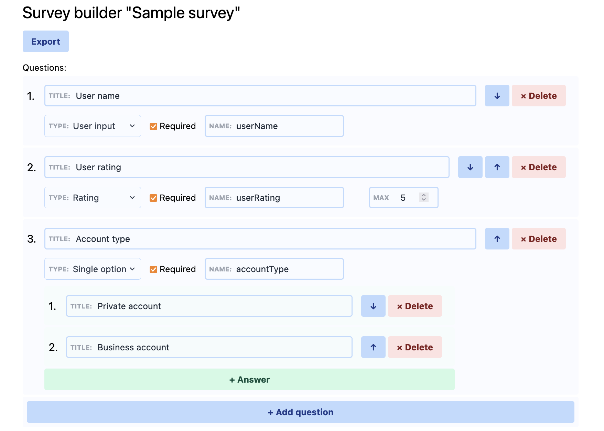

# Survey Builder

Small library to build custom surveys, export/import to JSON.



# Installation

Use sources or include `dist/survey-builder.css`, `dist/survey-builder[.min].js` files.

# Usage

Library will register custom component in global scope `SurveyBuilderInit`:

```ts
function SurveyBuilderInit(SurveyBuilderOpts): void;

export interface SurveyBuilderOpts {
  target: HTMLElement | Element;  // i.e. document.getElementById('placeholder')
  props: {
    haveTitle?: boolean;
    customInputNames?: boolean; // allow input of custom names for each question
    snapshot?: SurveyBuilderSnapshot; // see below
    onChange?: (snapshot: SurveyBuilderSnapshot) => void; // will be triggered on every change
    onExport?: (snapshot: SurveyBuilderSnapshot) => void; // will be triggered on export click
    debug?: boolean; // show debug info
  };
}
```

To use it:

```html
<head>
  <link rel='stylesheet' href='/dist/survey-builder.css'>
  <script src='/dist/survey-builder.min.js'></script>
</head>

<div id="element-root"></div>

<script>
  window.SurveyBuilderInit({
    target: document.getElementById('element-root'),
    props: {
      haveTitle: false,
      customInputNames: true,
      debug: true,
      snapshot: snapshot: {
        title: 'Sample survey',
        questions: [
          {
            id: 'q-1',
            title: 'User name',
            name: 'userName',
            type: 'input',
            required: true,
          },
          {
            id: 'q-2',
            title: 'User rating',
            name: 'userRating',
            type: 'rating',
            required: true,
            options: 5,
          },
          {
            id: 'q-3',
            title: 'Account type',
            name: 'accountType',
            type: 'single',
            required: true,
            answers: [
              {
                id: 'a-1',
                title: 'Private account',
                type: 'text',
              },
              {
                id: 'a-2',
                title: 'Business account',
                type: 'text',
              },
            ],
          },
        ],
      },
      onExport: (data) => {
        console.log('Congrats: export', data)
      },
      onChange: (data) => {
        console.log('Model changed', data)
      },
    },
  })
</script>
```
